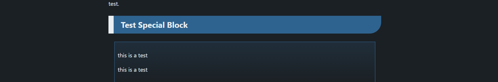
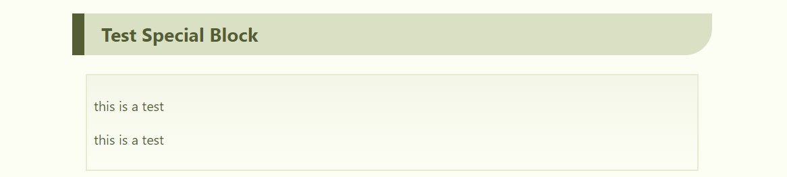

<!-- title: CSS test: note -->

<button onclick="toggleTheme()">ボタン</button>

<script>
function toggleTheme() {
    const root = document.documentElement;
    root.classList.toggle('light-theme');
}
// const root = document.documentElement;
// root.classList.toggle('light-theme');
</script>

# Test: note

## Section

### Subsection

This is a test.

This is a test.

This is a test. This is a test. This is a test. This is a test. This is a test. This is a test. This is a test. This is a test. This is a test. This is a test. This is a test. This is a test. This is a test. This is a test. This is a test. This is a test. 

This is a test.

* Item
  * Subitem
  * Subitem
* Item
  * Subitem
  * Subitem
1. Item
  1. Subitem
  2. Subitem
* [ ] Item
  * [ ] Subitem
  * [x] Subitem


## Section

### Subsection

This is a test.

* Item
  * Subitem
  * Subitem
* Item
  * Subitem
  * Subitem


## Section

test.

### Subsection

test.

#### Subsubsection

test.

##### Item

test.

###### Subitem

test.


## Test Special Block

test.

---

test.

> this is a test
>
> this is a test

test.

test. `inline test.` test.

test.

```python
import mylib

def this_is_a_test():
  pass

print("this is a test")
```

test.

<details><summary> MESSAGE </summary>
CONTENT

CONTENT

CONTENT

CONTENT

CONTENT

CONTENT

CONTENT
</details>

test.


test.



test.



test.
